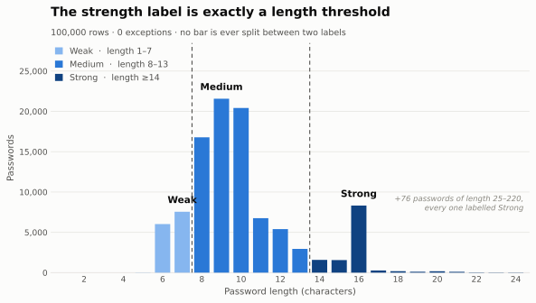

# Audit: how a 99.33%-accurate model turned out to be measuring nothing

The first version of this project trained a character-level TF-IDF + Linear SVM classifier to sort passwords into Weak / Medium / Strong, reported **99.33% accuracy**, and shipped it behind a Streamlit app. This document is the audit that took it apart.

The short version:

> **The `strength` label is a pure function of `len(password)`.** A three-line `if` statement reproduces all 100,000 labels with **zero** errors. The 51,808-feature model scored 99.33% — worse than the trivial rule it was unknowingly approximating.

Everything below is reproducible from `notebooks/00_audit.ipynb`.

---

## 1. The finding



Grouping the dataset by password length and label produces three intervals that never overlap:

| label | lengths present | count | mean length |
|---|---|---|---|
| 0 · Weak | 1 – 7 | 13,622 | 6.55 |
| 1 · Medium | 8 – 13 | 73,883 | 9.61 |
| 2 · Strong | 14 – 220 | 12,495 | 15.95 |

Not "mostly." Every row:

```sql
select count(*) as violations from Users
where not (
  (length(password) <= 7                  and strength = 0) or
  (length(password) between 8 and 13      and strength = 1) or
  (length(password) >= 14                 and strength = 2)
);
-- 0
```

Zero violations out of 100,000. The label carries no information that `len()` does not.

The labels were not assigned by humans or derived from breach outcomes — they were produced by a commercial password-strength meter, and length dominates its output. I trained a model to reverse-engineer a rule someone else had already written down.

## 2. What that does to the reported results

Adding the trivial baselines to the notebook's own comparison table — same 20,000-row test split, `random_state=42`, `stratify=y` — reorders it completely:

| model | accuracy | f1_weighted | f1_macro |
|---|---|---|---|
| **Length rule (3 lines of Python)** | **1.00000** | **1.000000** | **1.000000** |
| XGBoost | 1.00000 | 1.000000 | 1.000000 |
| Linear SVM *(shipped)* | 0.99330 | 0.993283 | 0.989683 |
| Logistic Regression | 0.98140 | 0.981302 | 0.970950 |
| Character-class-count rule | 0.86380 | 0.802640 | 0.641398 |
| Naive Bayes | 0.83045 | 0.769224 | 0.582627 |
| Majority class ("always Medium") | 0.73885 | 0.627885 | 0.283272 |

Three things fall out of this table:

1. **The shipped model is beaten by an `if` statement.** 134 of 20,000 test rows misclassified, on a task with a closed-form answer.
2. **A hand-written character-class heuristic (86.4%) beats Naive Bayes (83.0%).** One of the four "machine learning models" underperformed a rule that takes four lines and no training data.
3. **The headline number was never contextualised.** 99.33% sounds excellent against an implied 33% chance baseline. Against the majority class it is +25 points; against the actual data-generating process it is −0.67.

I never computed a baseline. That single omission is what let everything else through.

## 3. The unrealistic XGBoost alarm

XGBoost scored exactly `1.00000` on every metric. The notebook's conclusion:

> ***XGBoost*** achieved perfect scores (100%) across all metrics, which is unrealistic and indicates potential data leakage or it is memorizing structure. A nuclear test with shuffled labels still produced high accuracy, confirming that the XGBoost results are unreliable and should not be considered valid.
>
> — `Notebooks/02_modelling.ipynb`, cell 28

Both halves of that are wrong.

**"Unrealistic."** It was the only correct result in the notebook. A gradient-boosted tree ensemble splits on thresholds; the label *is* a threshold. XGBoost found `length ≤ 7` and `length ≤ 13` and stopped. Perfect accuracy was the truth about the data, and I discarded it as an artifact because it disagreed with my expectation that the problem was hard.

**"A shuffled-label test still produced high accuracy."** If that is what happened, the test was broken — shuffled labels must destroy accuracy. A leakage probe that fails to fail is a bug in the probe, not evidence about the model.

## 4. What the dataset is still good for

The labels are worthless. The **passwords** are not.

They come from the 000webhost breach (2015) — the row `accounts6000webhost.com` is a giveaway — which makes them real human-chosen passwords from a different population and a different era than RockYou (2009). That is precisely what a cross-corpus evaluation set needs to be.

One caveat that determines how it can be used: the table contains **100,000 rows and 100,000 distinct passwords**. Somebody deduplicated it before publishing. Frequency information is destroyed, so it cannot be used to *train* a probabilistic password model. Dedup is harmless as held-out attack targets, where each password is hit once.

So v2 keeps the file, drops the `strength` column at load time, and uses it as `test_xcorpus`.

## 5. What replaces it

The underlying error was accepting a problem statement without asking whether it was well-posed. "Classify passwords into three strength buckets" presumes those buckets mean something. They don't — strength isn't categorical, and no threshold on length, character classes, or entropy captures it. `Qwerty123456!!` satisfies every composition rule and dies in seconds.

The security literature settled this: **strength is guessability** — the number of attempts an adversary needs before arriving at your password. It's a continuous quantity, it's defined relative to an explicit attacker model, and it's measurable by running the attack.

v2 estimates it with a character-level neural language model trained on real breach data, converts model probability to a guess number via Monte-Carlo estimation (Dell'Amico & Filippone, CCS 2015), and validates by actually enumerating guesses against a held-out corpus. There is no label to overfit, and the metric — *what fraction of real passwords fall within a guess budget* — cannot be satisfied by rediscovering `len()`.

*(The full method write-up and threat model — `01-method.md`, `03-threat-model.md` — land with the phases that produce them.)*

## 6. Guardrails carried into v2

Each of these exists because of a specific failure above.

| Guardrail | Prevents |
|---|---|
| A trivial-baseline gauntlet runs on **every** evaluation and its output is committed as CSV — length rule, character-class rule, random ordering, and a frequency-ranked wordlist attack | §2 — never again reporting a number without knowing what free costs |
| No labels anywhere: the objective is likelihood of observed passwords; the metric is fraction cracked within budget | §1 — no heuristic to rediscover |
| Cross-corpus evaluation is mandatory (train RockYou 2009, test 000webhost 2015), with train/test disjointness asserted in CI | §5 — memorisation shows up as a collapsed curve |
| A too-good result triggers an investigation, not a dismissal. Sanity anchors (`123456` ranks top-10; random 16-char saturates; guess number monotone in log-probability) fail the build | §3 |
| One scoring path — `Scorer.score()` — imported by the CLI, the eval harness, and the app; a test AST-walks the app and fails if it imports a model directly | §4 |
| Calibration is plotted before the score is trusted: Monte-Carlo estimates against exact enumerated ranks | §4 — no more uncalibrated numbers shown as percentages |

## 7. Reproducing this audit

```bash
python scripts/make_audit_figure.py     # regenerates Figure 1 (asserts the claim before drawing it)
jupyter lab notebooks/00_audit.ipynb    # the full derivation
```

The original v1 notebooks, the TF-IDF vectorizer, and the shipped SVM are preserved under [`legacy/v1/`](../legacy/v1/) so the numbers in §2 can be re-derived rather than taken on faith.
